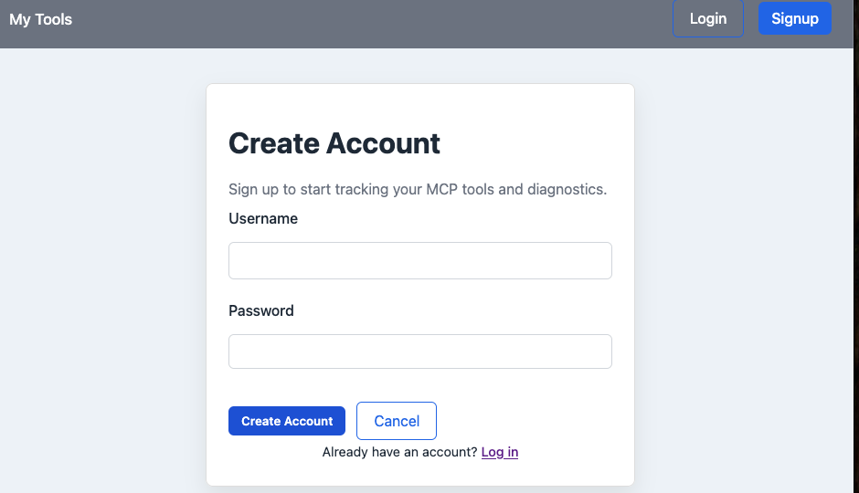

## MCP Tools CRUD

A CRUD application for managing MCP tools and their diagnostics.

Built with Node.js, Express, MongoDB, and EJS.

---

## Tech Stack

- Node.js
- Express
- MongoDB
- Mongoose
- EJS
- express-session
- connect-mongo
- method-override
- CSS

---

## Features

- User authentication (signup, login, logout)
- Session-based authentication
- Users can create, edit, and delete tools
- Users can add diagnostics to tools
- Diagnostics can be edited, deleted, and marked as resolved
- All data is scoped to the logged-in user

---

## Data Models

### User
- username
- password

### Tool
- name
- description
- platform
- tags
- riskLevel
- createdBy
- diagnostics (embedded subdocuments)

### Diagnostic
- attackType
- note
- severity
- resolved
- createdBy

---

## Routes

### Auth Routes
- GET /auth/signup
- POST /auth/signup
- GET /auth/login
- POST /auth/login
- GET /auth/logout

### Tool Routes
- GET /tools
- GET /tools/new
- POST /tools
- GET /tools/:id
- GET /tools/:id/edit
- PUT /tools/:id
- DELETE /tools/:id

### Diagnostic Routes
- GET /diagnostics/:toolId/new
- POST /diagnostics/:toolId
- GET /diagnostics/:toolId/:diagnosticId/edit
- PUT /diagnostics/:toolId/:diagnosticId
- DELETE /diagnostics/:toolId/:diagnosticId

---

## Middleware

- isLoggedIn middleware protects all non-auth routes
- Sessions stored in MongoDB using connect-mongo

---

## Setup

1. Install dependencies

2. Create a `.env` file with:
- MONGODB_URI=your_mongo_connection_string
- SESSION_SECRET=your_secret
- PORT=3333

4. Open in browser
http://localhost:3333

---

## Notes

- Server-rendered application using EJS
- No frontend framework
- Authorization enforced in controllers
- Diagnostics implemented as nested resources
